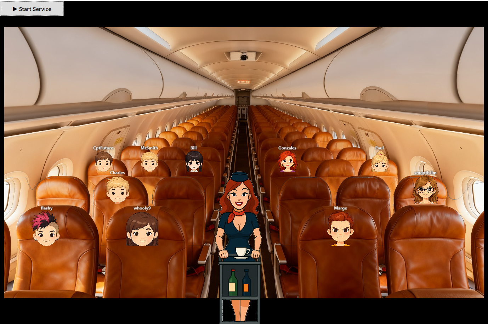
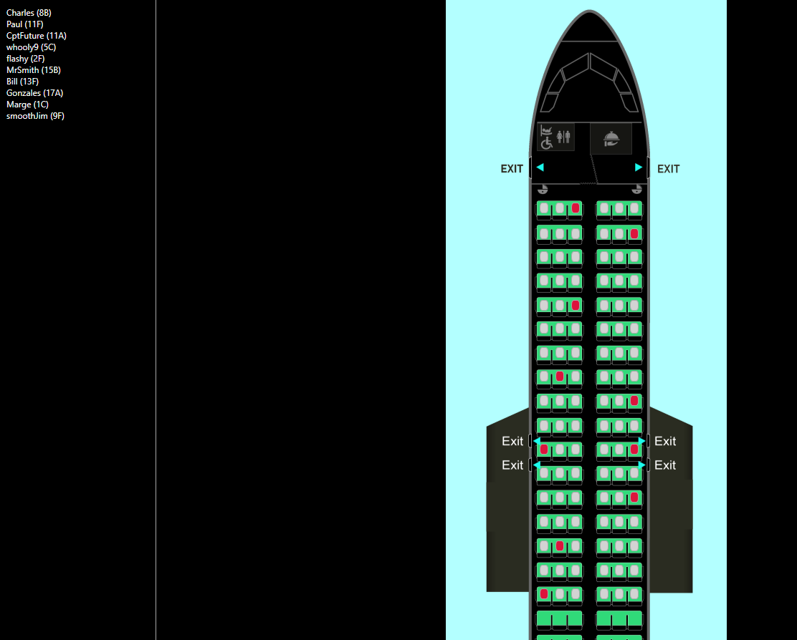
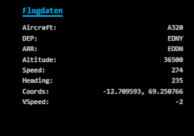
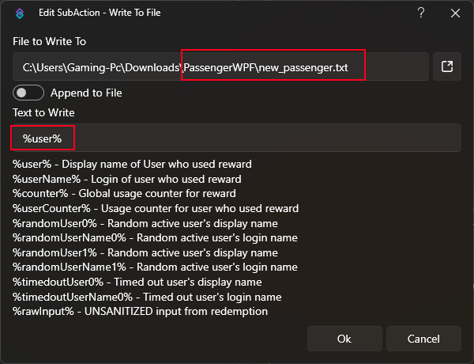
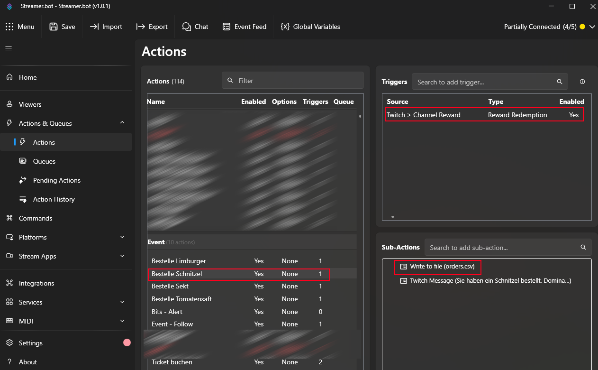
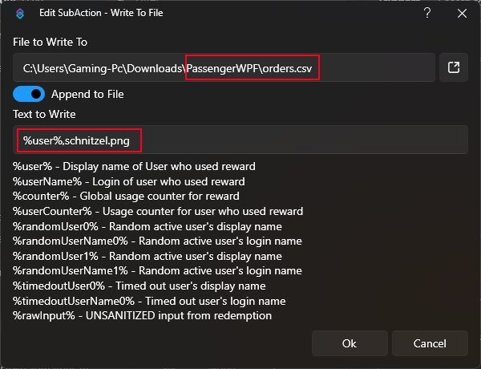

# PassengerWPF

PassengerWPF ist eine Windows-WPF-Anwendung zur Visualisierung einer Flugzeugkabine
mit Passagieren, Sitzlogik und Catering-Abläufen. Außerdem ist ein http-Overlay für OBS vorhanden. 
Man kann es testen. Einfach runterladen, entpacken und die exe ausführen. Test-Daten sind bereits inkludiert so dass man auch die Catering Animation testen kann.

Catering-Animation

Seatmap

Beispiel für das OBS-Overlay


---

## ✈️ Funktionen

- Darstellung einer Flugzeugkabine mit Positionierung von Passagieren
- Vielflieger-Ewigkeitsliste
- Catering-Animation mit Bestell-Bubbles über den Passagieren für Implementierung von Essensbestellungen
- CSV-basierte Datenquellen für Passagiere und Boarding-Status
- WPF-Oberfläche mit XAML, Animationen und Layout-Steuerung
- Overlay für Streams mit Anzeige von Flugparametern (simconnect-Anbindung)

---
  
## Voraussetzung

- Streamer.bot zum Befüllen der Passagierliste
- getestet mit MSFS 2020 (bezieht sich nur auf simconnect)

---

## 📦 Download

Die kompilierte Anwendung ist unter **Releases** verfügbar:

👉 [https://github.com/trombose009/PassengerWPF/v14.0](https://github.com/trombose009/PassengerWPF/releases/tag/v14.0)

Einfach das ZIP herunterladen, entpacken und die `PassengerWPF.exe` starten.

---

## 🛠 Systemvoraussetzungen

- Windows 10 oder Windows 11
- .NET Runtime (je nach Build)
- Empfohlen: Full-HD-Auflösung oder höher

---

## ▶️ Verwendung

1. Release-ZIP herunterladen
2. ZIP entpacken
3. `PassengerWPF.exe` starten
4. Passagier- und Boardingdaten werden aus CSV-Dateien geladen

## Streamer.bot / Befüllung der Dateien PassengerData.csv und orders.csv

Ich möchte hier nicht eine komplette Schritt für Schritt Anleitung zum Verwenden von Streamer.bot erstellen. Hier nur das Wichtigste, wie die Dateien gefüttert werden müssen bzw. ein Beispiel wie es geschehen kann.

Um ein Ticket "buchen" zu können muss im Streamer.bot folgende Action eingerichtet werden:


Der folgende C# code muss was den Pfad angeht angepasst und entsprechend in streamer.bot verwendet werden:
```
using System;
using System.IO;

public class CPHInline
{
    public bool Execute()
    {
        string passengerFilePath = @"C:\Users\Gaming-Pc\Downloads\PassengerWPF\passengerdata.csv";
        string tempFilePath = @"C:\Users\Gaming-Pc\Downloads\PassengerWPF\new_passenger.txt";

        try
        {
            // Neue Datei existiert?
            if (!File.Exists(tempFilePath))
            {
                CPH.LogWarn("Temporary passenger file not found.");
                return true;
            }

            // Benutzername aus temporärer Datei lesen
            string passenger = File.ReadAllText(tempFilePath).Trim();
            if (string.IsNullOrWhiteSpace(passenger))
            {
                CPH.LogWarn("Temporary passenger file is empty.");
                return true;
            }

            // CSV anlegen, falls nicht vorhanden
            if (!File.Exists(passengerFilePath))
            {
                File.WriteAllText(passengerFilePath,
                    "Name,Sitzplatz,Avatar,Order1,Order2,Order3,Order4" + Environment.NewLine);
                CPH.LogInfo("Passenger CSV file created with header.");
            }

            // Alle Zeilen der CSV lesen
            string[] lines = File.ReadAllLines(passengerFilePath);
            bool exists = false;

            foreach (string line in lines)
            {
                // Nur den Namen vergleichen (vor dem ersten Komma)
                string existingName = line.Split(',')[0].Trim();
                if (string.Equals(existingName, passenger, StringComparison.OrdinalIgnoreCase))
                {
                    exists = true;
                    break;
                }
            }

            if (exists)
            {
                CPH.LogInfo($"Passenger '{passenger}' already exists. Skipping.");
            }
            else
            {
                // Name + 6 leere Felder, in neuer Zeile
                string newLine = passenger + ",,,,,,";
                File.AppendAllText(passengerFilePath, Environment.NewLine + newLine);
                CPH.LogInfo($"Passenger '{passenger}' added to CSV.");
            }

            // Temporäre Datei löschen
            File.Delete(tempFilePath);
        }
        catch (Exception ex)
        {
            CPH.LogError("Error processing passenger: " + ex.Message);
        }

        return true;
    }
}

```
Aus technischen Gründen ist das bei der Ticket-Buchung so notwendig. 

Damit der Streamerbot Essens-/Getränkebestellungen dem Programm hinzufügen kann, müssen diese in der Form Name,bilddatei.png in die Datei Orders geschrieben werden. Das lässt sich wie in den folgenden zwei Screenshots zu sehen, umsetzen. Es muss immer zunächst der PAssagier schon vorhanden sein (Ticket gebucht haben) damit er eine Bestellnug aufgeben kann.





---

## 🧩 Technische Details

- Sprache: VB.NET / C#
- Framework: WPF
- UI: XAML
- Datenhaltung: CSV-Dateien
- Fokus: Boarding-System für Streams in Kombination mit streamer.bot

---

## 📄 Lizenz / Hinweis

keine Garantie für nichts und niemanden
